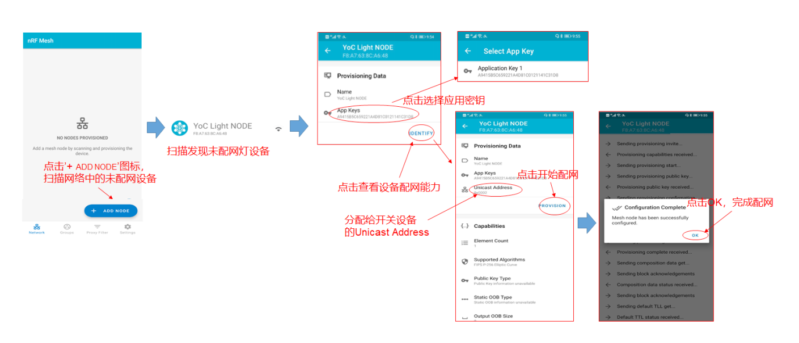

# 平头哥 CB6121 开发板BLE及BLE Mesh试用报告

首先非常感谢平头哥OCC芯片开放社区的[第一期蓝牙训练营](https://occ.t-head.cn/community/post/detail?spm=a2cl5.14300636.0.0.9f90180fXSl6S5&id=3813934449516228608)让我有机会获得了一块CB6121蓝牙开发板。

因为手边配套设备较少，所以只能简陋地进行评估测试。

测试参考应用：

BLE评估：[蓝牙键盘应用示例](https://occ.t-head.cn/vendor/detail/download?spm=a2cl5.14290816.0.0.d3ef180fNk36A2&id=648919380272349184&vendorId=3706716635429273600&module=3#sticky)

BLE Mesh评估：[蓝牙Mesh灯控开发实例](https://occ.t-head.cn/community/post/detail?spm=a2cl5.14300636.0.0.4c41180fq8gHRo&id=3808220608148942848)

## 开箱


## 试用准备材料

* 材料：

1. 平头哥 CB6121 开发板一块
2. Micro USB数据线一根


3. 三个闭合的订书针(用来短接PIN脚)(也可以使用其它材料来进行短接)


## 制作镜像

这里我提供了自己编译的[蓝牙键盘应用](rom/hid_keyboard.hexf)和[蓝牙Mesh灯控应用](rom/mesh_switch_node.hexf)镜像，你可以直接使用并跳过本章。如果想体验一下编译流程请继续阅读：

我使用的是Ubuntu 20.04系统进行镜像的制作。

首先安装必备库：

```bash
sudo apt-get update
sudo apt-get install gawk make
```

### 蓝牙键盘应用

首先打开 https://occ.t-head.cn/vendor/detail/download?id=648914921458761728&vendorId=3706716635429273600&module=4#sticky , 点击`关联芯片资源`标签，下载BLE_SDK_V1_1_2


然后将其解压，在解压后的SDK根目录中打开终端，执行：

```bash
cp defconfigs/defconfig_ch6121_evb_solution defconfig
make clean
make
```


编译执行之后，出现上图所示消息则代表成功。

随后进入HID Keyboard工程目录，进行编译：

```bash
cd applications/bluetooth/hid_keyboard
cp defconfig_ch6121_evb defconfig
make clean
make
```


出现相关镜像消息即代表编译成功。

编译成功的镜像位于工程目录`generated/total_image.hexf`

### 蓝牙Mesh灯控应用

首先打开 https://occ.t-head.cn/vendor/detail/download?id=648914921458761728&vendorId=3706716635429273600&module=4#sticky , 点击`关联芯片资源`标签，下载BLE_MESH_SDK_V1


打开下载后的压缩文件，解压其中的压缩文件`ble_mesh_sdk_v1.0.0.zip`


在解压后的SDK根目录中打开终端，执行：

```bash
chmod a+x build.sh
./build.sh defconfigs/defconfig_ch6121_evb_mesh_node applications/bluetooth/mesh_switch_node/ j64
```


出现相关镜像消息即代表编译成功。

编译成功的镜像位于SDK目录`applications/bluetooth/mesh_switch_node/generated/total_image.hexf`

## 镜像烧录

1. 下载[PhyPlusKit](http://wiki.phyplusinc.com/doku.php?id=menu:phytools)，随后打开：

2. 勾选 UART Setting ，串口配置为波特率：115200，停止位：1，校验：NO
3. 使用Micro USB线将开发板连接电脑
4. 点击 Connect ,连接串口
5. 选择 Flash_writer 标签页
6. 选择 HEX 烧入方式标签页
7. 选择要烧录的镜像 *.hexf 文件
8. 将拨码开关拨到 VDD


9. 按开发板上的 RESET 按键，重启开发板
10. 点击 Erase 擦除
11. 点击 Write 烧写


12. 将拨码开关回拨到 GND

## 运行应用

这里使用的是[友善串口调试助手](http://www.51xiazai.cn/soft/261875.htm) 进行串口调试和信息显示

### 蓝牙键盘应用 

烧录镜像[蓝牙键盘应用](rom/hid_keyboard.hexf)，启动友善串口调试助手，配置皮特率: 115200, 数据位: 8, 校验位: None, 停止位: 1, 流控: None，点击启动按钮，按开发板上的 RESET 按键，重启开发板，进行串口调试：


打开手机蓝牙进行配对并连接：


使用开发板串口模拟发送键值'a'，手机文本编辑区将显示该键值:

```bash
keysend 4
```

取消配对，重启开发板后生效:

```bash
kv setint btsetting 0
sys reboot
```

### 蓝牙Mesh灯控应用

手机下载`nRF Mesh` APP（可以应用商店搜索，安卓端也可以[下载APK文件](https://github.com/NordicSemiconductor/Android-nRF-Mesh-Library/releases)安装）

然后使三个PIN脚短接：


随后烧录镜像[蓝牙Mesh灯控应用](rom/mesh_switch_node.hexf)，启动友善串口调试助手，配置皮特率: 115200, 数据位: 8, 校验位: None, 停止位: 1, 流控: None，点击启动按钮，按开发板上的 RESET 按键，重启开发板，进行串口调试：

参考官方说明：

1. 设备开启 Unprovisoin Device Beacon 广播，串口上输出 `Mesh light node demo` 信息。


2. MESH 灯设备配网可参照下图，通过手机 nRF Mesh APP 操作，绑定应用密钥的索引为 1




3. 设置智能灯设备中的 Generic OnOff Server Model 的应用密钥，绑定应用密钥的索引为 1


4. 手机操作设备成功入网后，开发板上 D2 绿灯将常亮，


5. 通过手机 nRF Mesh APP 绑定 Generic OnOff Server Model 的 APP Key 后，控制灯的开关状态


## 使用感想

CB6121是平头哥及奉加微电子为PHY6212设计的开发套件，板载BLE5.0芯片PHY6212、资源丰富、工具齐全。USB供电兼串口、调试方便。支持串口透传、OAT、BLE Mesh应用开发、网关端Mesh配网及控制功能。我后续将会利用此开发板尝试将自己在第一期蓝牙训练营的想法落地成为现实。

同时欢迎大家为我的创意投票（智能车管）：https://occ.t-head.cn/community/createfuture/createfuturehoem?id=3824508189836709888 ，谢谢！
