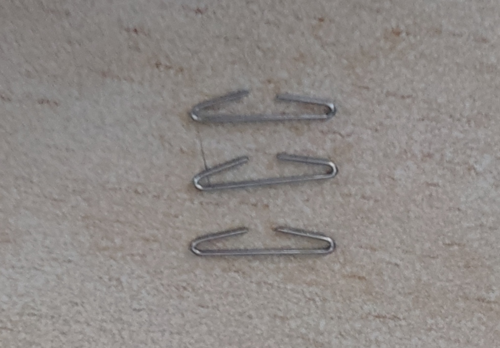
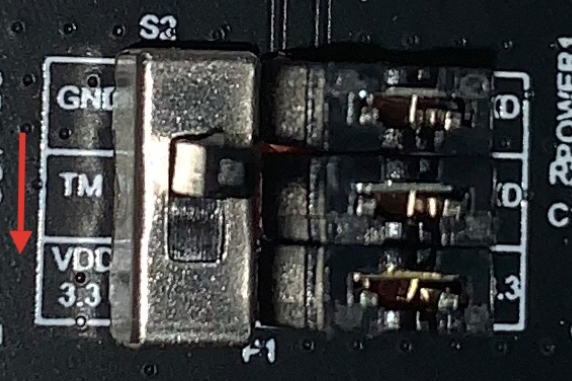
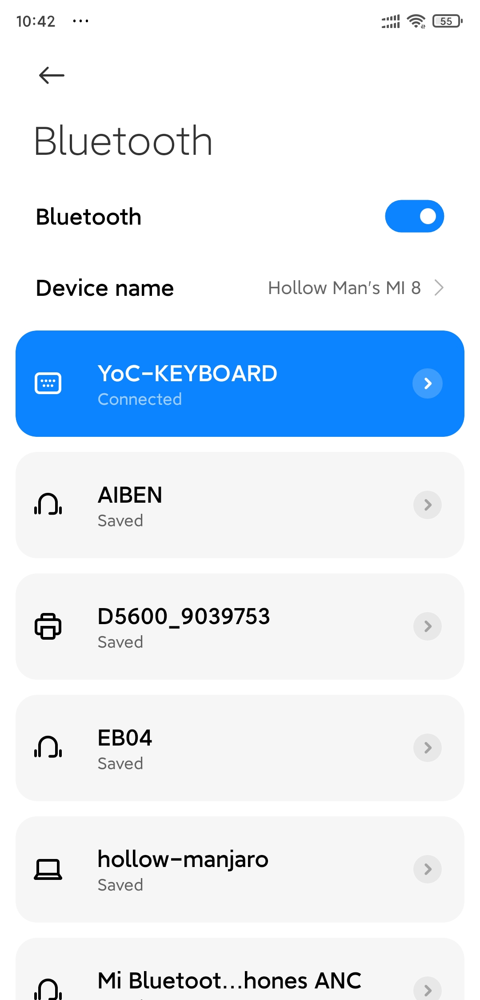
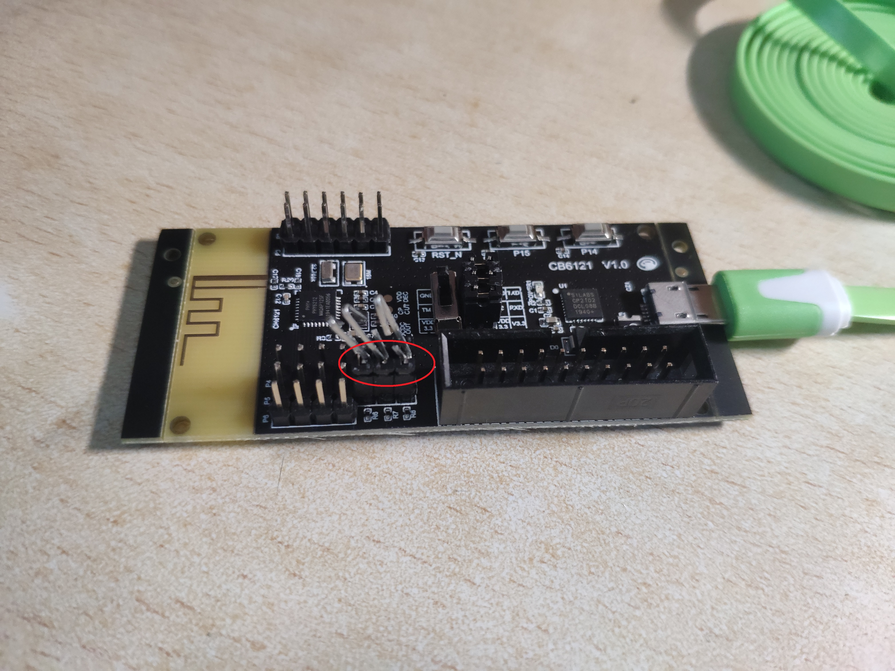
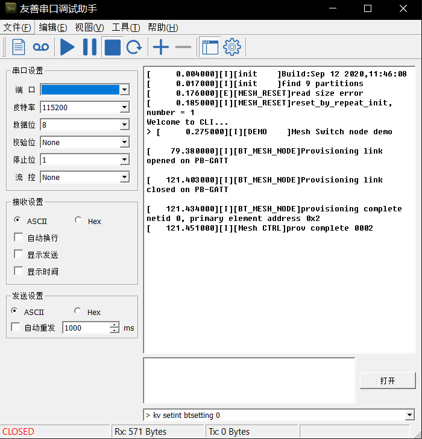
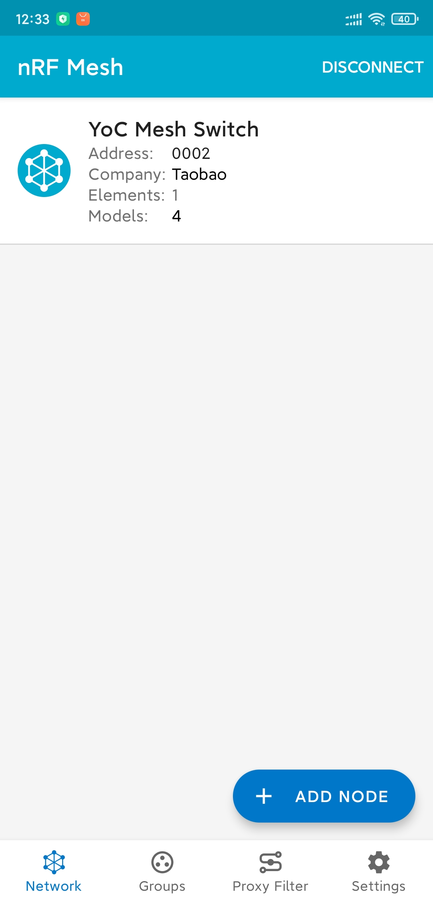
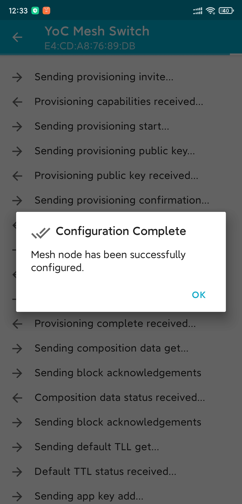
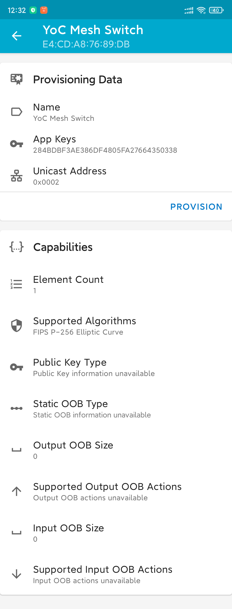

# Trial report on CB6121 BLE & BLE Mesh development board


First of all, thanks for the [First Bluetooth Training Camp](https://occ.t-head.cn/community/post/detail?spm=a2cl5.14300636.0.0.9f90180fXSl6S5&id=3813934449516228608) of OCC (Open Chip Community) letting me have a chance to get a CB6121 Bluetooth development board.

Due to the lack of supporting equipment at hand, the evaluation test can only be carried out rudimentary.

Test reference application:

Ble evaluation: [Bluetooth keyboard application example](https://occ.t-head.cn/vendor/detail/download?spm=a2cl5.14290816.0.0.d3ef180fNk36A2&id=648919380272349184&vendorId=3706716635429273600&module=3#sticky)


Ble mesh evaluation: [Bluetooth mesh lamp control development example](https://occ.t-head.cn/community/post/detail?spm=a2cl5.14300636.0.0.4c41180fq8gHRo&id=3808220608148942848)

## Unpacking


## Trial preparation materials

*Materials:

1. OCC CB6121 development board

2. One micro USB cable


3. Three closed staples (for short-circuit PINs) (other materials can also be used for short-circuit)



## Making a ROM

Here I provide my own compiled [Bluetooth keyboard application](rom/hid_keyboard.hexf) And [Bluetooth mesh lamp control application](rom/mesh_switch_node.hexf), you can use it directly and skip this chapter. If you want to experience the compilation process, please continue to read:

I use the Ubuntu 20.04 system for image production.

First install the prerequisite Library:

```bash
sudo apt-get update
sudo apt-get install gawk make
```

### Bluetooth keyboard application

First open https://occ.t-head.cn/vendor/detail/download?id=648914921458761728&vendorId=3706716635429273600&module=4#sticky , click the `关联芯片资源` tab to download BLE_SDK_V1_1_2


Then unzip it, open the terminal in the SDK root directory after decompression, and execute the following steps:

```bash
cp defconfigs/defconfig_ch6121_evb_solution defconfig
make clean
make
```


After the compilation and execution, the message shown in the figure above indicates success.

Then enter the HID keyboard project directory and compile it

```bash
cd applications/bluetooth/hid_keyboard
cp defconfig_ch6121_evb defconfig
make clean
make
```


If the relevant image message appears, the compilation is successful.

The successfully compiled image is located in the project directory `generated/total_image.hexf`

### Bluetooth mesh lamp control application

First open https://occ.t-head.cn/vendor/detail/download?id=648914921458761728&vendorId=3706716635429273600&module=4#sticky , click the `关联芯片资源` tab to download BLE_MESH_SDK_V1


Open the downloaded compressed file and unzip the compressed file `ble_mesh_sdk_v1.0.0.zip`


Execute in the root directory of the SDK

```bash
chmod a+x build.sh
./build.sh defconfigs/defconfig_ch6121_evb_mesh_node applications/bluetooth/mesh_switch_node/ j64
```


If the relevant image message appears, the compilation is successful.

Successfully compiled images are located in the SDK directory `applications/bluetooth/mesh_switch_node/generated/total_image.hexf`

## Image burning

1. Download [PhyPlusKit](http://wiki.phyplusinc.com/doku.php?id=menu:phytools), then open:

2. Check UART setting, serial port configuration is baud rate: 115200, stop bit: 1, check: No

3. Connect the development board to the computer with micro USB cable

4. Click Connect to connect the serial port

5. Select Flash_writer tab

6. Select the hex burning mode tab

7. Select the image *. Hexf file to be burned

8. Turn the dial switch to VDD



9. Press the reset button on the development board to restart the development board

10. Click erase to erase

11. Click write


12. Set the dial switch back to GND

## Running applications

Here we use [friendly serial debugging assistant](http://www.51xiazai.cn/soft/261875.htm) to debug the serial port and display the information

### Bluetooth keyboard application


Burn image [Bluetooth keyboard application](rom/hid_keyboard.hexf), start the friendly serial port debugging assistant, configure Pitt rate: 115200, data bit: 8, check bit: none, stop bit: 1, flow control: none, click Start button, press reset button on the development board, restart the development board, and conduct serial port debugging


Turn on Bluetooth for pairing and connection:




Use the serial port of the development board to send the key value 'a', which will be displayed in the mobile phone text editing area:

```bash
keysend 4
```

Cancel pairing and restart the development board

```bash
kv setint btsetting 0
sys reboot
```

### Bluetooth mesh lamp control application


Download and install `NRF mesh` app (search in app store or download [APK file on Android](https://github.com/NordicSemiconductor/Android-nRF-Mesh-Library/releases))

Then short the three pin pins:




Then burn the image [Bluetooth mesh lamp control application] (rom/mesh_switch_node.hexf). Start the friendly serial port debugging assistant, configure Pitt rate: 115200, data bit: 8, check bit: none, stop bit: 1, flow control: none. Click the start button, press the reset button on the development board to restart the development board and debug the serial port

Refer to official instructions:

1. The device turns on unprovisoin device beacon broadcast, and outputs "mesh light node demo" information on the serial port.



2. The mesh lamp equipment distribution network can refer to the figure below and bind the application key through NRF mesh app operation index of 1






3. Set the application key of generic onoff server model in the smart light device, and bind the application key index 1


4. After the mobile phone operating equipment is successfully connected to the network, the D2 green light on the development board will always be on,


5. After binding the app key of generic onoff server model through NRF mesh app, control the switch state of the light


## Use feeling

Cb6121 is a development kit designed by OCC and Fengjia microelectronics for phy6212. It has the advantages of abundant resources and complete tools. USB power supply and serial port, convenient debugging. Support serial port transparent transmission, oat, ble mesh application development, gateway mesh distribution network and control functions. I will use this development board to try to realize my idea in the first phase of Bluetooth training camp.

At the same time, you are welcome to vote for my creative idea (smart vehicle management) https://occ.t-head.cn/community/createfuture/createfuturehoem?id=3824508189836709888 Thank you!